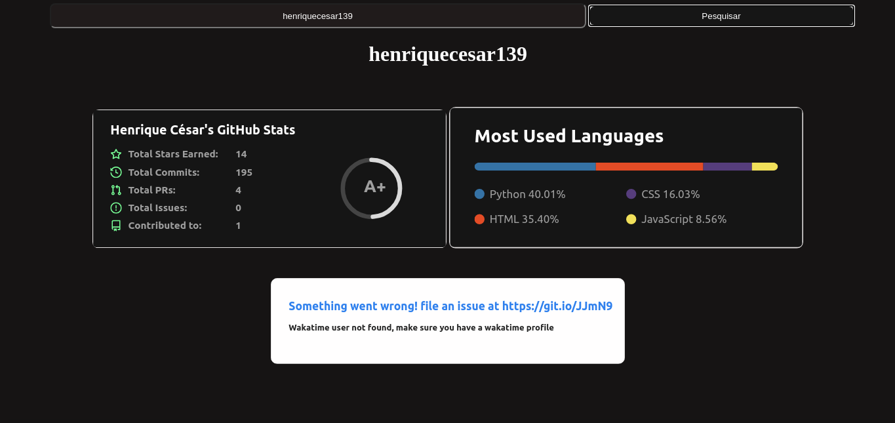

<h1>GitHub - Info</h1>

<h2>Uma ferramenta de captura de informações do github</h2>

Digite seu nome de usuário e clique no botão de pesquisar para encontrar suas informações do github

<ul>
  <li>Total de commit's</li>
  <li>Total de estrelas </li>
  <li>Total de pull request's</li>
  <li>Total de issues </li>
  <li>Contribuições </li>
  <li>Linguagens mais usadas </li>
</ul>

<h3>Mobile </h3>

<h3>Desktop </h3>
